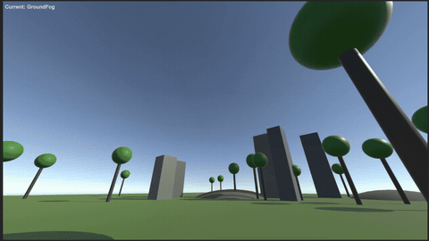

# Volumetrics

**by Mustafa Bektaş**

A Unity project for creating dynamic, volumetric clouds and atmospheric scattering. This implementation focuses on performance and visual variety, with several customizable weather presets.

## Weather Presets

**Light Clouds** - Scattered, wispy clouds with bright atmospheric scattering

**Dense Clouds** - Thick, voluminous cloud formations with reduced visibility

**Stormy Clouds** - Dark, heavy clouds with dramatic lighting and high density

**Ground Fog** - Low-lying fog effect perfect for atmospheric ground-level scenes

**Sunset Clouds** - Warm, golden-hour clouds

## Technical Features

-   **Ray Marching:** The volumetric clouds are rendered using a ray marching algorithm in a custom shader. The number of steps is adjustable for performance vs. quality.
-   **Procedural Cloud Generation:** Clouds are generated using a combination of 3D noise (fbm) and a height-based density function. The cloud shape, coverage, and density can be adjusted.
-   **Lighting and Scattering:** The lighting model uses a Henyey-Greenstein phase function to simulate light scattering through the clouds to create realistic visual effects. It also includes a silver lining effect.
-   **Temporal Filtering:** An optional temporal filtering pass is available to smooth the result and reduce artifacts to improve the performance.
-   **Performance Optimization:** The render scale of the effect can be adjusted to balance performance and visual quality.

## What's Missing / Next Steps

- Lightning effects for stormy weather
- God rays/volumetric lighting shafts
- Cloud shadows on terrain
- Multiple light source support